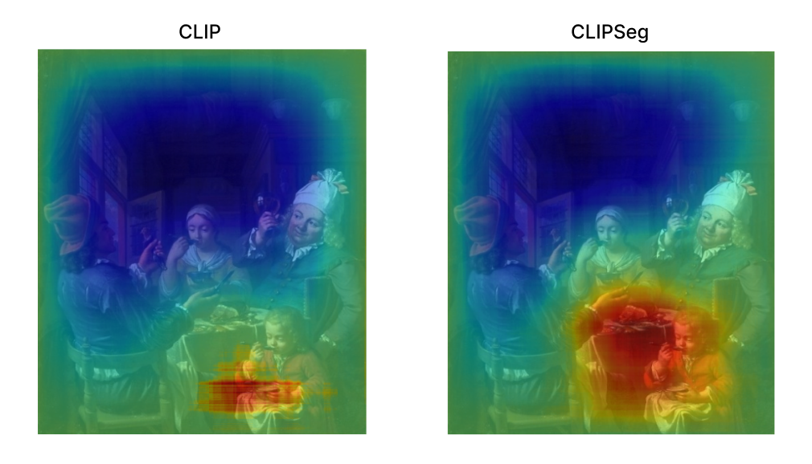
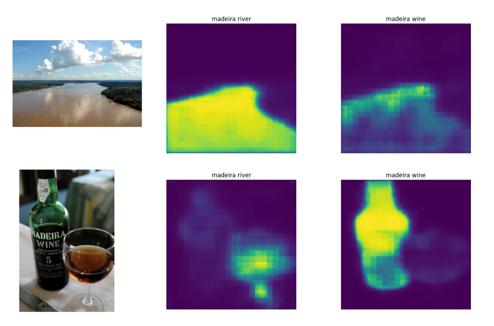
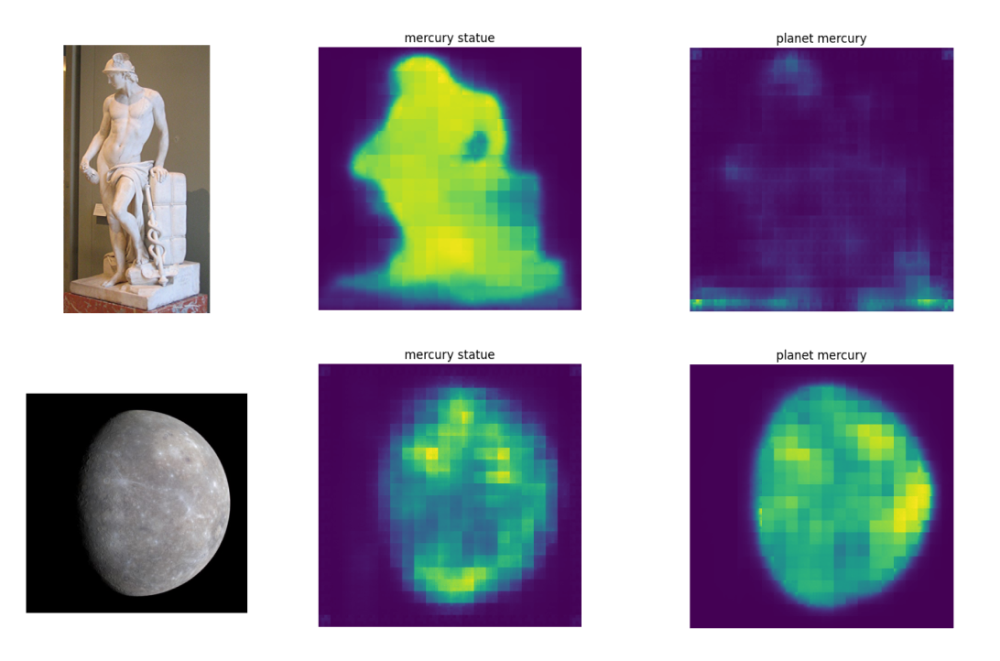

# Visual WSD using CLIPSeg

### The project

Visual Word Sense Disambiguation (VWSD) is a recently introduced task that arises from the latest developments in the field of Multimodal Natural Language Processing. Given a context sentence, a target word, and a series of candidate images, the goal of this task is to identify the image that most appropriately represents the sense of the tar- get word for the given target word. The proposed baseline approach to tackle this problem is to utilize a pre-trained CLIP model to compute the similari- ties between the context and the candidate images, picking the image with the highest score. As an additional experiment, this work shows how utilizing a specialized version of CLIP for image segmentation (CLIPSeg) leads to a strong improvement in results. The intuition behind this choice is that the task of segmentation can be considered closer to a kind of disambiguation in the field of images, where the model has to properly focus on highlight- ing specific parts of the image and separate it from the surroundings. Finally, to deal with multilingual test data, input contexts are translated using specific translation models for Italian and Farsi.

### Quantitative results

In order to establish a baseline, a first test was per- formed with the CLIP model on the English test dataset. This method yielded an accuracy score of 58.31%, which still proves the versatility of CLIP in zero-shot learning scenarios without any additional fine-tuning. Supporting the intuition described in the Introduction, the CLIPSeg model’s accuracy reached 63.28%, significantly outperforming the baseline by +4.97%. Subsequently, a first attempt was made to test the CLIPSeg model on the Italian and Farsi datasets without any translation, yielding very poor results (18.03% for Italian and 9.5% for Farsi). As expected, the usage of translation models drastically increased the performances in both cases, scoring 50.49% for the Italian dataset and 32% for the Farsi one.

## Qualitative analysis

### Saliency maps

Saliency maps allow us to interpret which regions of the input image were of particular interest with respect to the model’s predictions. In this context, we want to interpret which regions of the image are closer to the text query. The idea is to compare samples where the CLIPSeg model predicted correctly and the baseline CLIP missed the prediction, to check whether this is due to CLIPSeg’s better capabilities at recognizing relevant parts of the image.

### Image segmentation

In another attempt to investigate CLIPSeg’s capabilities at visual disambiguation, another experi- ment was performed by comparing different contexts corresponding to a certain ambiguous word and looking at how much the segmentation changes with the same word in different contexts for images that were correctly disambiguated. For example we have the ambiguous word "madeira" and the images and contexts for "madeira river" and "madeira wine". As can be noticed, for example using the context "madeira wine" in the river image results in a much weaker segmentation that the respective correct context "madeira river". Another significant example can be seen for the mercury statue. This suggests a correlation between the segmentation and disambiguation capabilities of the model.

